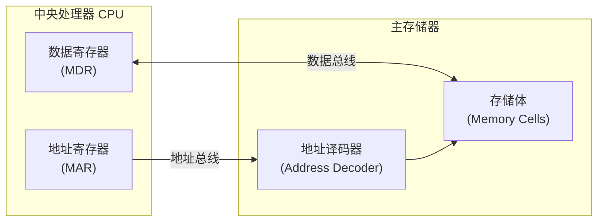
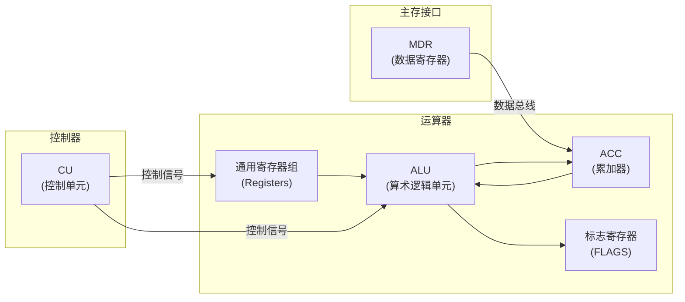
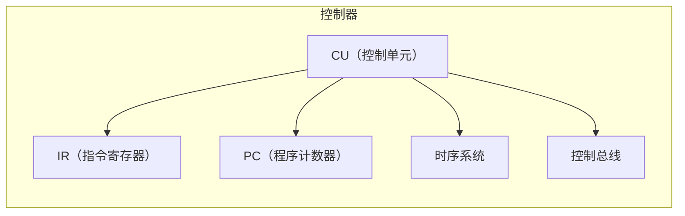
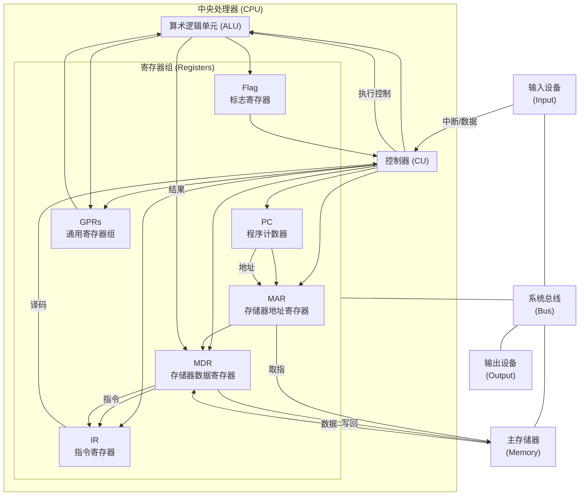

# 计算集系统层次结构

完整的计算机系统应包括配套的硬件设备和软件系统。

软件的功能可以用硬件取代。软件更灵活，硬件更快。

## 输入输出设备

熟知的键盘鼠标显示器打印机等。

## 存储器

分为主存储器和辅助存储器。CPU 能直接访问的是主存储器。

主存储器的基本组成

MAR（Memory Address Register）：存放 CPU 想要访问的主存地址。

地址译码器：根据 MAR 的内容，选中主存中对应的存储单元。

存储体：真正存放数据的存储单元集合。

MDR（Memory Data Register）：CPU 与主存之间数据传送的缓冲寄存器。

地址总线 / 数据总线：实现 CPU 与主存的通信。

### 相联存储器

相联存储器（Associative Memory / CAM）定义：按内容（关键字）访问的存储器，而不是按地址访问。

但一般也可以按地址寻址。

特点：查询时并行比较所有单元，访问速度快；容量通常较小，硬件复杂

类型：

- 全相联：数据可存放在任意单元，灵活但硬件复杂

- 直接映射：固定位置存放，硬件简单，但命中率低

- 组相联：折中方案，每组内全相联，每组外固定

应用：

- CPU Cache

- TLB（页表快表）

- 网络路由表

## 运算器

通用寄存器组：用于暂存运算操作数与结果。

ACC（累加器）：常作为算术逻辑运算的一个操作数或结果的存放处。

ALU（Arithmetic Logic Unit）：执行加减乘除、逻辑运算、移位等。

标志寄存器（FLAGS）：记录运算结果状态（如零标志、进位标志、溢出标志等）。

CU（控制单元）：发出控制信号，指挥 ALU 和寄存器的操作。

MDR：主存与运算器的数据接口。

| 项目   | 程序状态寄存器（PSR / PSW）        | 标志寄存器（Flags Register）          |
| ---- | ------------------------- | ------------------------------ |
| 本质   | 保存 CPU 状态信息的寄存器           | 其中的一部分字段                       |
| 主要内容 | 各类状态位（标志位）、中断控制位、模式位、特权级等 | 算术逻辑运算的结果标志位（如 Z、C、N、V）        |
| 功能   | 控制程序执行流程、中断响应、工作模式切换      | 反映上一次运算的结果，供条件跳转或异常判断使用        |
| 包含关系 | ✅ 通常包含标志寄存器的所有标志位         | ❌ 只包含 PSR 的一部分（标志位部分）          |
| 示例   | ARM 的 PSR、x86 的 EFLAGS    | x86 的 FLAGS、ARM 的条件标志位 N Z C V |

## 控制器

CU（Control Unit，控制单元）：
控制器的核心部件，负责分析指令并发出控制信号，协调计算机各部件的工作。

IR（Instruction Register，指令寄存器）：
存放当前正在执行的指令，由 CU 解码后发出相应控制信号。

PC（Program Counter，程序计数器）：
存放下一条将要执行的指令地址，在每条指令取出后自动加一或由转移指令修改。

时序系统（Timing System）：
产生各种时钟脉冲和控制节拍，为 CU 发出控制信号提供时间基准。

控制总线（Control Bus）：
将 CU 产生的控制信号传送给运算器、主存储器、I/O 接口等部件，实现统一协调。

## CPU

一般运算器和控制器会被集成在一个芯片上，称为中央处理器 CPU。

## 主机

CPU 和主存储器共同构成主机。

CPU 和主存储器之间通过一组总线相连，总线中有地址、控制和数据三组信号线。

MAR 中的地址信息会直接送到地址线上，用于指向读 or 写操作的主存储器储存单元。

控制线中有读 or 写信号线，指出数据是从 CPU 写入主存储器（还是相反），进而控制将 MDR 中的数据送到数据线上（还是相反）。

## 外设

除主机外的其它硬件统称外部设备。

## 冯诺依曼结构的模型机

基本思想：存储程序。而不是根据每个程序独立设计硬件。

